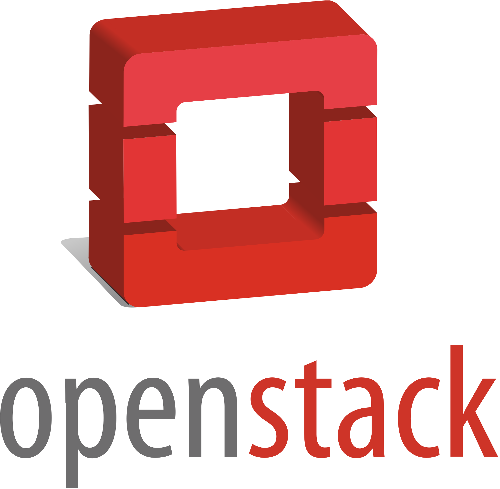

# OPENSTACK DEVELOPMENT
[](https://opensource.org/licenses/MIT)

<p align="left">
  
</p>

Deploy an OpenStack Dev instance with Vagrant and Ansible.

## Abstract

*OpenStack* is a cloud operating system that controls large pools of compute, storage, and networking resources throughout a datacenter,
<br>
all managed through a dashboard that gives administrators control while empowering their users to provision resources through a web interface.
<br> 
OpenStack is a fully functional cloud platform as defined by the National Institute of Standards and Technology. 
<br>
This means that OpenStack basically resembles the behaviour of public clouds. 
<br>
Users can request compute, network and storage resources on-demand through a self-service portal. 
<br>
Although they are provided in the form of virtual machines, virtual network and virtual disks, exactly as in the traditional virtualisation management platforms, they are defined through the APIs.

**OpenStack itself does not handle virtualisation**.
<br> 
Instead, it leverages the existing virtualisation technologies. 
<br>
Therefore, OpenStack is more like a wrapper around traditional virtualisation tools, enabling cloud-native capabilities.

*DevStack* is a series of extensible scripts used to quickly bring up a complete OpenStack environment based on the latest versions of everything 
from git master. 
<br>
It is used interactively as a development environment and as the basis for much of the OpenStack project’s functional testing.

The source is available at https://opendev.org/openstack/devstack.

## Requirements
The code in this repo has been tested on `Ubuntu 22.04` with
- `Vagrant 2.2.19`
- `ansible 2.10.8`
- `VirtualBox 6.1.34_Ubuntur150636`

It should work even with older versions of the aforementioned software.

## Instructions
clone this repo and start the provisioning:
```console
git clone \
vagrant up
```

After the provisioning is completed (It may takes up to 30 minute), you can login to openstack web dashboard at
the following url: 
<br>
`http://192.168.56.10/`

<p align="left">
  
</p>

At this point you can use this instance to learn and do experiments with OpenStack.
